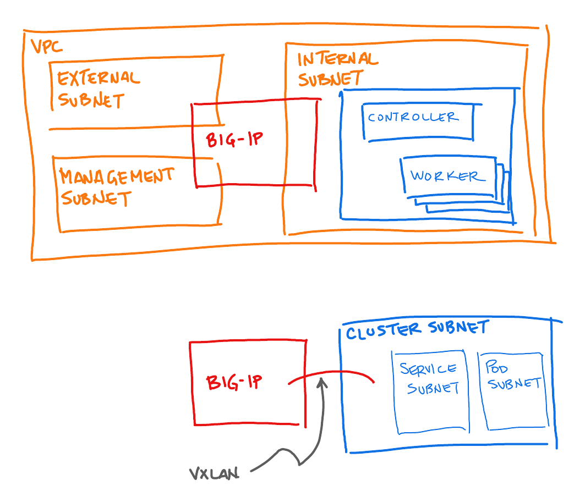

## Overview

This is a **very preliminary** module to configure a BIG-IP and Kubernetes cluster to interoperate using [F5's Container Ingress Services](https://clouddocs.f5.com/containers/latest/userguide/kubernetes/). If you want to use this, take some time to peruse the code and familiarize yourself with its many undocumented assumptions.

The assumed BIG-IP is in a 3-NIC configuration, spanning management, external, and internal subnets. The internal subnet is synonymous with the kubernetes node subnet allowing the BIG-IP to converse with the nodes of the cluster. The vxlan tunnel and associated selfip make the BIG-IP a member of the cluster subnet and consequently able to converse with the service and pod subnets.

<!-- BEGIN_TF_DOCS -->
## Requirements

No requirements.

## Providers

| Name | Version |
|------|---------|
|  [external](#provider\_external) | n/a |
|  [null](#provider\_null) | n/a |

## Modules

| Name | Source | Version |
|------|--------|---------|
|  [postbuild-config-as3](#module\_postbuild-config-as3) | github.com/mjmenger/terraform-bigip-postbuild-config//as3 | v0.5.1 |
|  [postbuild-config-do](#module\_postbuild-config-do) | github.com/mjmenger/terraform-bigip-postbuild-config//do | v0.5.1 |

## Resources

| Name | Type |
|------|------|
| [null_resource.cis_init](https://registry.terraform.io/providers/hashicorp/null/latest/docs/resources/resource) | resource |
| [external_external.tunnelmac](https://registry.terraform.io/providers/hashicorp/external/latest/docs/data-sources/external) | data source |

## Inputs

| Name | Description | Type | Default | Required |
|------|-------------|------|---------|:--------:|
|  [bigip\_default\_gateway\_address](#input\_bigip\_default\_gateway\_address) | n/a | `any` | n/a | yes |
|  [bigip\_external\_address](#input\_bigip\_external\_address) | the address of the BIG-IP external/public NIC | `any` | n/a | yes |
|  [bigip\_internal\_gateway\_address](#input\_bigip\_internal\_gateway\_address) | n/a | `any` | n/a | yes |
|  [bigip\_k8s\_partition](#input\_bigip\_k8s\_partition) | the partition (AS3 tenant) in which the ingress virtual servers will be created. | `any` | n/a | yes |
|  [bigip\_management\_address](#input\_bigip\_management\_address) | the address of the BIG-IP management NIC | `any` | n/a | yes |
|  [bigip\_password](#input\_bigip\_password) | the password to use for authentication when calling the BIG-IP's API endpoints. | `any` | n/a | yes |
|  [bigip\_private\_address](#input\_bigip\_private\_address) | the address of the BIG-IP's internal/private NIC on the kubernetes node network | `any` | n/a | yes |
|  [bigip\_tunnel\_name](#input\_bigip\_tunnel\_name) | the name of the vxlan tunnel connecting the BIG-IP to the kubernetes pod network | `any` | n/a | yes |
|  [bigip\_tunnel\_overlay\_address](#input\_bigip\_tunnel\_overlay\_address) | the address that the BIG-IP uses over the tunnel to the pod network | `any` | n/a | yes |
|  [bigip\_username](#input\_bigip\_username) | the username to use when calling the BIG-IPs API endpoints. | `any` | n/a | yes |
|  [cidr](#input\_cidr) | n/a | `any` | n/a | yes |
|  [infra\_private\_key](#input\_infra\_private\_key) | the value of the private key to connect to the kubernetes controller node | `any` | n/a | yes |
|  [infra\_private\_key\_path](#input\_infra\_private\_key\_path) | the path to the private key file used to connect to the kubernetes controller node | `any` | n/a | yes |
|  [k8s\_controller\_address](#input\_k8s\_controller\_address) | the address of the kubernetes controller node | `any` | n/a | yes |
|  [k8s\_controller\_username](#input\_k8s\_controller\_username) | the username to use to connect to the kubernetes controller | `any` | n/a | yes |
|  [k8s\_podsubnet](#input\_k8s\_podsubnet) | n/a | `any` | n/a | yes |
|  [nameserver](#input\_nameserver) | n/a | `any` | n/a | yes |

## Outputs

| Name | Description |
|------|-------------|
|  [tunnelmac](#output\_tunnelmac) | n/a |
<!-- END_TF_DOCS -->